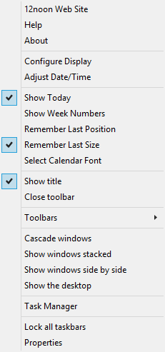

# Timekeeper Documentation by [12noon LLC](https://12noon.com/)

Timekeeper provides you with more information about the date and time than the
simple Windows clock in your taskbar notification area.
Timekeeper also gives you quick and easy access to a calendar.

Timekeeper conveniently displays the date and time in whatever format you want on your Windows taskbar.
It can also display the date and time on any edge of your desktop.
Timekeeper doesn't obscure what you're working on or use valuable screen real estate.

If you hover the mouse over the clock display, Timekeeper displays the date and
time in a tooltip (formatted in the “long format” for the current locale).

These images show some of the different ways Timekeeper can be configured.
The first example shows how Timekeeper can display information on multiple lines.

Timekeeper displays its information on your main Windows desktop toolbar by default.
You can make Timekeeper wider or narrower by dragging the “grip” control to left of the clock.
When you hover the cursor over the grip control, the cursor will change to a
two-headed-arrow resize cursor to indicate that you can now resize the toolbar.

You can drag Timekeeper somewhere else on the deskband or change it to a vertical deskband.
To move the Timekeeper toolbar, click and drag it by the left of the clock.
When you click, the cursor will change to a four-headed-arrow move cursor to
indicate that you can now drag the toolbar.

## Enable Timekeeper

To enable or disable Timekeeper, right-click on an empty spot on your toolbar.
Select _Toolbars_ and click on _12noon Timekeeper_.

## Configure Timekeeper

You can configure Timekeeper's display to use your own date or time formats,
text, font, text color, background color, and alignment.
This option is available on the context menu. (See below.)

 The **Format** field is
where you specify what information Timekeeper will display.
Click the arrow to the right of the field to see the special characters that
you can use to specify various date and time components (and other values).
You can also enter plain text for Timekeeper to display, such as colons to
separate the time fields or a label for the week number.
There are some predefined time and date formats in the menu that you can select.
If you wish, you can then edit them to create your own custom format.

Click the **Text color** or **Background** control to display a window where
you can choose a predefined color or create a custom color for the clock's text and background.
You can select a transparent background for the clock by checking **Transparent background**.

**Known issue:** Transparency might not work well. Use a black background instead.

### Formats

| Code | Description | Example |
| --- | --- | --- |
| %#I:%M:%S | 12-hour time | 12:08:14 |
| %#I:%M %p | 12-hour time with meridian | 12:08 PM |
| %H%M%S | 24-hour time | 020814 |
| %#m/%#d/%Y | Short date | 9/7/2005 |
| %Y.%m.%d | Short date, year first | 2005.09.07 |
| %a %#d %b |  | Wed 7 Sep |
| %A, %B %#d, %Y |  | Wednesday, September 7, 2005 |
| %c | Short date and time format for locale | (depends on locale) |
| %#c | Long date and time format for locale | (depends on locale) |
| %x | Short date format for locale | (depends on locale) |
| %#x | Long date format for locale | (depends on locale) |
| %X | Time format for current locale | (depends on locale) |
| **Time Formats** |  |  |
| %H | Hour in 24-hour format with zero (00-23) | 08 23 |
| %#H | Hour in 24-hour format without zero (0-23) | 8 23 |
| %I | Hour in 12-hour format with zero (01-12) | 08 11 |
| %#I | Hour in 12-hour format without zero (1-12) | 8 11 |
| %M | Minute with leading zero (00-59) | 06 |
| %#M | Minute without leading zero (0-59) | 6 |
| %S | Second with leading zero (00-59) | 04 |
| %#S | Second without leading zero (0-59) | 4 |
| %p | Locale's A.M/P.M. indicator | AM PM |
| %z | Time zone name or abbreviation | Central CST |
| **Date Formats** |  |  |
| %a | Abbreviated weekday name | Thu |
| %A | Full weekday name | Thursday |
| %w | Weekday as number (0-6, Sunday is 0) | 5 |
| %b | Abbreviated month name | Dec |
| %B | Full month name | December |
| %m | Month (01-12) | 09 |
| %#m | Month (1-12) | 9 |
| %d | Date with leading zero (01-31) | 08 |
| %#d | Date without leading zero (1-31) | 8 |
| %y | Year without century with leading zero (00-99) | 0097 |
| %#y | Year without century without leading zero (0-99) | 97 |
| %Y | Year with century with leading zero | 0397 |
| %#Y | Year with century without leading zero | 2021 |
| %j | Day of year with leading zero (001-366) | 024 |
| %#j | Day of year without leading zero (1-366) | 24 |
| %T | Week of year with Sunday as first day of week (01-54) | 02 |
| %#T | Week of year with Sunday as first day of week (1-54) | 2 |
| %U | Week of year with Sunday as first day of week (00-53) | 07 |
| %#U | Week of year with Sunday as first day of week (0-53) | 7 |
| %V | Week of year with Monday as first day of week (01-54) | 05 |
| %#V | Week of year with Monday as first day of week (1-54) | 5 |
| %W | Week of year with Monday as first day of week (00-53) | 06 |
| %#W | Week of year with Monday as first day of week (0-53) | 6 |
| **Special Characters** |  |  |
| %% | Percent sign (%) |  |
| \\n | Line separator | 18:52 Central 5 Jun 2021 |

## Calendar

Timekeeper can display a calendar so that you can easily plan meetings, vacations,
or see when you should make your next haircut appointment.
Click the primary mouse button (usually the left one) anywhere on Timekeeper's
date/time display, and it will display a calendar.
You can drag any edge or corner of the calendar and enlarge or shrink the window
to show more months (up to four across or four down).

You can select a series of dates to make it easier for you to refer back to them.
(Timekeeper does not remember the selection after you close the calendar.)

The calendar displays current date and time in the caption.

Close the calendar by clicking the ‘x' in the caption or by pressing **ALT+F4**.

The following keys can help you navigate the calendar:

| Hotkey | Action |
| ------ | ------ |
| Home | Select first day of current month |
| End | Select last day of current month |
| CTRL+Home | Select first day of first month on display |
| CTRL+End | Select last day of last month on display |
| PageUp | Move back one month |
| PageDown | Move forward one month |
| CTRL+PageUp | Move back one year |
| CTRL+PageDown | Move forward one year |

Other calendar options include specifying the font, hiding the _Today_ information,
displaying the week numbers, remembering the calendar's position, and remembering the calendar's size.

**Known issue:** If you reduce the size of the font, the calendar is not resized immediately.
The band must be closed and re-opened to use the new size. This is a Windows limitation.

## More Options

To access the **context menu**, right-click on the Timekeeper deskband.
The menu allows you to perform the following functions:

*   Obtain information about 12noon LLC Products.
*   Display this Help document.
*   Display the About window.
*   Configure the date/time display.
*   Adjust the system date/time.
*   Specify whether the calendar should highlight today's date.
*   Specify whether the calendar should display week numbers.
*   Specify whether the calendar should remember its position.
*   Specify whether the calendar should remember its size.
*   Specify the calendar's font.

The other commands are standard Windows commands. For example, you can use
the _Show Title_ command to hide the deskband's _Timekeeper_ title.

## Known Issues

If the size of the calendar font is made smaller, the calendar is not resized.
The band must be closed and re-opened to see the new size. This is a Windows limitation.
