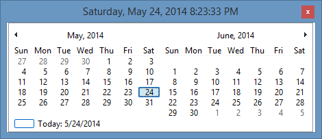

# Timekeeper by [12noon LLC](https://12noon.com/)

Display the date and time on your taskbar in any format and color (including transparent).
Get rid of that tiny, useless Windows clock. Pop up a calendar when you need one.
Resize it to show as many or as few months as you want.
Move Timekeeper around and it'll remember its position and size, or not—your choice).

Timekeeper is a deskband (like the taskbar) that displays the current date and
time in whatever format you specify. When you click on it with your mouse,
it displays a calendar that you can resize to display as many months as you want.

You can drag Timekeeper wherever you want it—even vertically—just like your other deskbands.

I was inspired to write Timekeeper because of TClockEx.
Even in 2000, it was an interesting (but fragile) solution and hasn't been updated since.
When Windows introduced the concept of deskbands, small bars that can be hidden, displayed,
resized, floated, and moved. I wrote Timekeeper to take advantage of these modern features.

 Timekeeper is in English and has been translated into German.

Windows 11 removed support for desk bands (such as Timekeeper) when they rewrote File Manager.
In addition, now that Windows 11 and 10 display the date in the taskbar, I have invested less
effort into updating Timekeeper. Since there is still considerable interest in it,
I released Timekeeper as open source under the MIT license.

## Calendar

When you click on Timekeeper with your mouse, it displays a calendar.

Note: the Windows calendar control follows this rule for numbering the weeks of the year:
["Week 1 is defined as the first week that contains at least four days."](https://learn.microsoft.com/en-us/windows/win32/controls/month-calendar-control-styles)

## Configuration

To access Timekeeper's menu, right-click on Timekeeper. The menu allows you to perform the following functions:

*   Obtain information about 12noon Products.
*   Display this Help document.
*   Display the About window.
*   Configure the date/time display.
*   Adjust the system date/time.
*   Specify whether the calendar should highlight today's date.
*   Specify whether the calendar should display week numbers.
*   Specify whether the calendar should remember its position.
*   Specify whether the calendar should remember its size.
*   Specify the calendar's font.

## Requirements

Timekeeper runs on Microsoft® Windows® 11 and 10.
The Timekeeper installer contains both 32-bit and 64-bit versions.
(Microsoft has ended mainstream support for Windows 8.1, 8, 7, XP
and Server 2003, so those platforms are no longer officially supported.)

## Known Issues

Transparency does not work well. Use a black background instead.

## History

**1.62.9:** Built with latest Microsoft Windows SDK and Visual Studio 2022 runtime.

**1.62.4:** Built with latest Microsoft Windows SDK and Visual Studio 2020 runtime.

**1.62.3:** Built with latest Microsoft Windows SDK and Visual Studio 2017 (15.4.1) runtime.

**1.62.2:** Built with latest Microsoft Windows SDK and Visual Studio 2015 Update 3 runtime. (Last version to officially support Windows 7 and 8.1.)

**1.62.0:** Removed compatibility warning. Changed default to be opaque (not transparent). Improved handling of Windows translucency.

**1.61.0:** Fixed issue with composition. Known issue: transparency does not work well. Use a black background instead.

**1.60.0:** Added support for Windows 7 and later. Removed support for Windows XP themes.

**1.44.0:** Updated installer for 64-bit.

**1.42:** Fixed calendar not displaying (because mouse click went to tooltip).

**1.41:** Eliminated tooltip flickering. Fixed menu display error in rare occasions. Renamed 64-bit DLL.

**1.40:** Auto-reload format. Added %T and %V.

**1.32:** Added Adjust Date/Time command.
